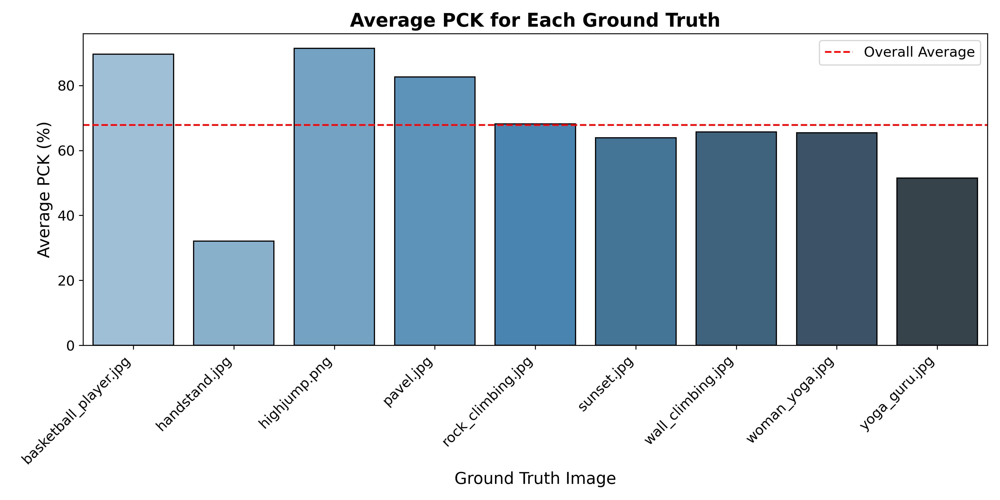
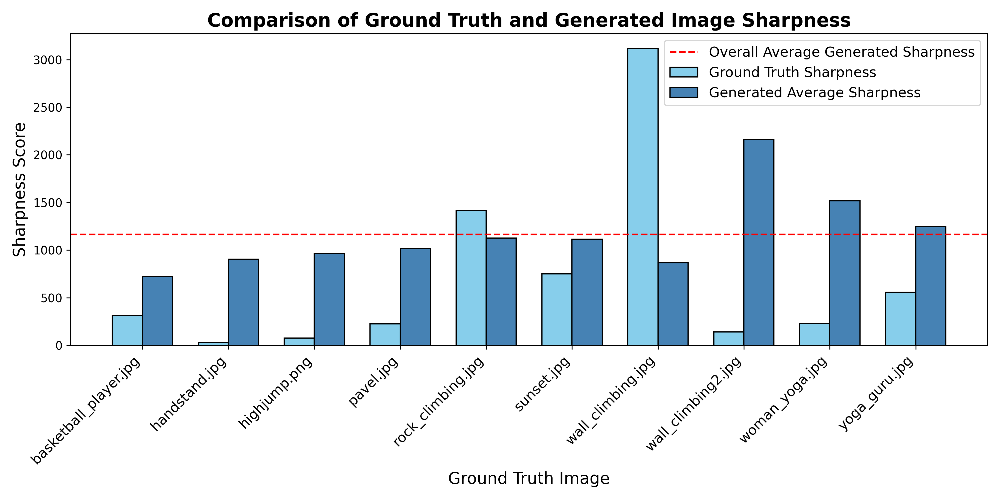
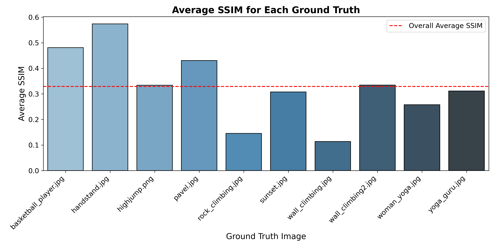
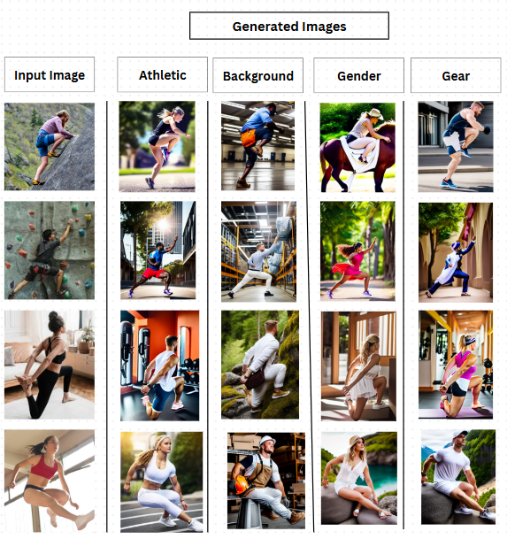

# myolab-takehome-Shweg4
MyoLab take-home assignment: Image generation with pose consistency 

These are the steps  to be followed to run the Controlnet model with OpenPose:

First, we need to create a new conda environment

    conda env create -f environment.yaml
    conda activate control

All models and detectors can be downloaded from [Hugging Face page](https://huggingface.co/lllyasviel/ControlNet). Make sure that SD models are put in "ControlNet/models" and detectors are put in "ControlNet/annotator/ckpts". Make sure that you download all necessary pretrained weights and detector models from that Hugging Face page, including HED edge detection model, Midas depth estimation model, Openpose, and so on. 

Stable Diffusion 1.5 + ControlNet (using human pose)

    python gradio_pose2image.py

For a public link give (share = True) while launcging the gradio - block.launch(server_name='0.0.0.0',share=True)
You need to input an image for the openpose to detect the pose.

<table>
  <tr>
    <th>Ground Truth / Image</th>
    <th>Detected Pose / Conditional Image</th>
    <th>A White Female Playing Basketball in a Court</th>
  </tr>
  <tr>
    <td>
      
    </td>
    <td>
      
    </td>
    <td>
      
    </td>
  </tr>
</table>


# Evaluation

This section explains how to evaluate the generated images against the ground truth images using various metrics and how to organize the folder structure for proper evaluation.

## Evaluation Metrics
The following metrics are used for evaluation:

1. **Sharpness**:
   - Measures the clarity of an image using the Laplacian variance method.
   - A higher sharpness score indicates a sharper and more detailed image.

2. **SSIM (Structural Similarity Index)**:
   - Compares the structural similarity between a ground truth image and a generated image.
   - Scores range from 0 to 1:
     - **1**: Perfect match.
     - **0**: No similarity.
   - A higher SSIM score indicates that the generated image is closer to the ground truth.

3. **PCK (Percentage of Correct Keypoints)**:
   - Evaluates pose estimation accuracy by comparing the detected keypoints of the ground truth image and the generated images.
   - A higher percentage indicates better alignment of keypoints.

## Folder Structure
Organize your data in the following directory structure to ensure that evaluation scripts run correctly:

evaluation/
├── ground_truth/
│   ├── example1.jpg
│   ├── example2.jpg
│   └── example3.jpg
├── generated/
│   ├── example1/
│   │   ├── gen1.jpg
│   │   ├── gen2.jpg
│   │   └── gen12.jpg
│   ├── example2/
│   │   ├── gen1.jpg
│   │   ├── gen2.jpg
│   │   └── gen12.jpg
│   └── example3/
│       ├── gen1.jpg
│       ├── gen2.jpg
│       └── gen12.jpg


### Description of Folders
1. **`ground_truth/`**:
   - Contains the reference images that serve as the ground truth.
   - Example: `example1.jpg`, `example2.jpg`, etc.

2. **`generated/`**:
   - Contains subfolders corresponding to each ground truth image.
   - Each subfolder contains multiple generated images (e.g., `gen1.jpg`, `gen2.jpg`, etc.) for comparison.

### Running the Evaluation
Follow these steps to run the evaluation:

1. Ensure that your folder structure matches the layout described above.
2. Use the provided evaluation scripts to compute:
   - **Sharpness** scores for generated images.
   - **SSIM** values between ground truth and generated images.
   - **PCK** scores for pose alignment.
3. The evaluation scripts will output:
   - Average metric scores for each ground truth image.
   - Overall averages across all ground truth and generated images.

---

### Example Output
Once the evaluation is complete, the output will include:
- A table summarizing sharpness, SSIM, and PCK scores.
- A bar chart visualizing the average scores for each ground truth image.

---

This structure ensures clear organization and accurate evaluation of generated images against ground truth references. Let me know if you need help setting up or running the scripts!

Once the environment is set up, you can run the respective Python scripts for evaluation:

    - To calculate **SSIM (Structural Similarity Index)**, run:
      ```bash
      python ssim.py
      ```

    - To calculate **PCK (Percentage of Correct Keypoints)**, run:
      ```bash
      python pck.py
      ```

    - To calculate **Sharpness**, run:
      ```bash
      python sharpness.py
      ```

Each script outputs results in both tabular and graphical formats for easy analysis.

## Evaluation Metrics Summary

The table below summarizes the results of evaluation metrics across ground truth and generated images:

<table>
  <tr>
    <th>Average PCK for Each Ground Truth</th>
    <th>Comparison of Ground Truth and Generated Image Sharpness</th>
    <th>Average SSIM for Each Ground Truth</th>
  </tr>
  <tr>
    <td>
      
      <p><strong>Summary:</strong> This graph illustrates the Percentage of Correct Keypoints (PCK) for each ground truth image. PCK evaluates the alignment of keypoints between the ground truth and generated images. Higher PCK values indicate better alignment.</p>
      <p><strong>Inference:</strong> Some ground truth images, such as <em>basketball_player.jpg</em>, show consistently high alignment, whereas others like <em>handstand.jpg</em> exhibit lower PCK values, suggesting room for improvement in those cases.</p>
    </td>
    <td>
      
      <p><strong>Summary:</strong> This graph compares the sharpness of ground truth images and the average sharpness of their generated counterparts. Sharpness is measured using the Laplacian variance method.</p>
      <p><strong>Inference:</strong> Generated images generally exhibit higher sharpness than ground truth images, as seen in cases like <em>wall_climbing2.jpg</em>. However, this may not always correspond to visual quality, as excessive sharpness can introduce noise.</p>
    </td>
    <td>
      
      <p><strong>Summary:</strong> This graph shows the Structural Similarity Index (SSIM) for each ground truth image, comparing how closely generated images resemble their respective ground truth.</p>
      <p><strong>Inference:</strong> SSIM values vary significantly across images. While <em>highjump.png</em> achieves a high SSIM score, suggesting good structural resemblance, others like <em>sunset.jpg</em> score lower, indicating discrepancies in generated outputs.</p>
    </td>
  </tr>
</table>

## Note

The `results` folder contains the outputs from the evaluation scripts, including charts and summaries of the computed metrics. The `source` and `target` folders house the custom data scraped from the web, with `source` representing the input data and `target` representing the desired outputs for comparison.

## Results

### ControlNet with Pose SD1.5

ControlNet is a neural network architecture that enhances pre-trained diffusion models by conditioning their outputs on specific input data. In this evaluation, **Pose SD1.5** was used to guide the generation of images based on pose estimations. This allows for fine-grained control over the generated outputs, ensuring alignment with the desired pose and structure. 

The result displayed below is a **collage of the ground truth image and the corresponding generated images** (cherrypicked output). These generated images are conditioned on the required attributes, such as pose alignment, structural similarity, and image sharpness. This collage serves as a visual representation of the model’s capability to generate pose-guided images.

<div style="text-align: center;">
  <h3>Final Evaluation Results</h3>
  
  <p><strong>Summary:</strong> This chart represents the final evaluation results combining metrics like PCK, SSIM, and sharpness. The overall performance highlights the potential of ControlNet with Pose SD1.5 in generating pose-guided images. While the cherrypicked result demonstrates its strengths, further work is required to ensure consistency across all outputs.</p>
</div>

## Compute Power Used

The evaluations and model generation were performed using the following compute setup:

+-----------------------------------------------------------------------------+ | NVIDIA-SMI 510.47.03 Driver Version: 510.47.03 CUDA Version: 11.6 | |-------------------------------+----------------------+----------------------+ | GPU Name Persistence-M| Bus-Id Disp.A | Volatile Uncorr. ECC | | Fan Temp Perf Pwr:Usage/Cap| Memory-Usage | GPU-Util Compute M. | | | | MIG M. | |===============================+======================+======================| | 0 Tesla V100-SXM2... On | 00000000:00:1E.0 Off | 0 | | N/A 35C P0 24W / 300W | 0MiB / 16384MiB | 0% Default | | | | N/A | +-------------------------------+----------------------+----------------------+

+-----------------------------------------------------------------------------+ | Processes: | | GPU GI CI PID Type Process name GPU Memory | | ID ID Usage | |=============================================================================| | No running processes found | +-----------------------------------------------------------------------------+


**Summary**:
- The computations were carried out on an **NVIDIA Tesla V100-SXM2 GPU**, with **16 GB of memory**.
- **CUDA Version:** 11.6
- The GPU's maximum power consumption is **300W**, and the temperature during evaluations was **35°C**.

# Citation

    @misc{zhang2023adding,
      title={Adding Conditional Control to Text-to-Image Diffusion Models}, 
      author={Lvmin Zhang and Anyi Rao and Maneesh Agrawala},
      booktitle={IEEE International Conference on Computer Vision (ICCV)}
      year={2023},
    }

[Arxiv Link](https://arxiv.org/abs/2302.05543)
https://github.com/lllyasviel/ControlNet.gi
