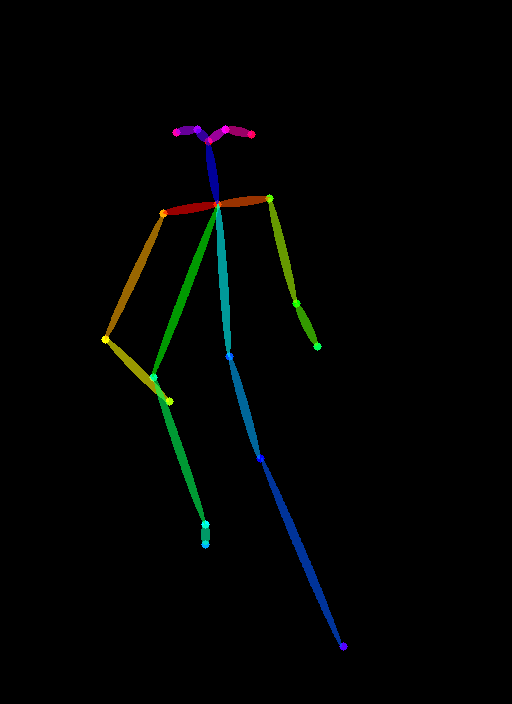

# myolab-takehome-Shweg4
MyoLab take-home assignment: Image generation with pose consistency 

These are the steps you would have to follow to run the Controlnet model with openpose 

First create a new conda environment

    conda env create -f environment.yaml
    conda activate control

All models and detectors can be downloaded from [Hugging Face page](https://huggingface.co/lllyasviel/ControlNet). Make sure that SD models are put in "ControlNet/models" and detectors are put in "ControlNet/annotator/ckpts". Make sure that you download all necessary pretrained weights and detector models from that Hugging Face page, including HED edge detection model, Midas depth estimation model, Openpose, and so on. 

Stable Diffusion 1.5 + ControlNet (using human pose)

    python gradio_pose2image.py

You need to input an image for the openpose to detetec the pose.

<table>
  <tr>
    <th>Ground Truth / Image</th>
    <th>Detected Pose / Conditional Image</th>
    <th>A White Female Playing Basketball in a Court</th>
  </tr>
  <tr>
    <td>
      
    </td>
    <td>
      
    </td>
    <td>
      
    </td>
  </tr>
</table>

# Evaluation

This section explains how to evaluate the generated images against the ground truth images using various metrics and how to organize the folder structure for proper evaluation.

## Evaluation Metrics
The following metrics are used for evaluation:

1. **Sharpness**:
   - Measures the clarity of an image using the Laplacian variance method.
   - A higher sharpness score indicates a sharper and more detailed image.

2. **SSIM (Structural Similarity Index)**:
   - Compares the structural similarity between a ground truth image and a generated image.
   - Scores range from 0 to 1:
     - **1**: Perfect match.
     - **0**: No similarity.
   - A higher SSIM score indicates that the generated image is closer to the ground truth.

3. **PCK (Percentage of Correct Keypoints)**:
   - Evaluates pose estimation accuracy by comparing the detected keypoints of the ground truth image and the generated images.
   - A higher percentage indicates better alignment of keypoints.

## Folder Structure
Organize your data in the following directory structure to ensure that evaluation scripts run correctly:

evaluation/
├── ground_truth/
│   ├── example1.jpg
│   ├── example2.jpg
│   └── example3.jpg
├── generated/
│   ├── example1/
│   │   ├── gen1.jpg
│   │   ├── gen2.jpg
│   │   └── gen12.jpg
│   ├── example2/
│   │   ├── gen1.jpg
│   │   ├── gen2.jpg
│   │   └── gen12.jpg
│   └── example3/
│       ├── gen1.jpg
│       ├── gen2.jpg
│       └── gen12.jpg

### Description of Folders
1. **`ground_truth/`**:
   - Contains the reference images that serve as the ground truth.
   - Example: `example1.jpg`, `example2.jpg`, etc.

2. **`generated/`**:
   - Contains subfolders corresponding to each ground truth image.
   - Each subfolder contains multiple generated images (e.g., `gen1.jpg`, `gen2.jpg`, etc.) for comparison.

### Running the Evaluation
Follow these steps to run the evaluation:

1. Ensure that your folder structure matches the layout described above.
2. Use the provided evaluation scripts to compute:
   - **Sharpness** scores for generated images.
   - **SSIM** values between ground truth and generated images.
   - **PCK** scores for pose alignment.
3. The evaluation scripts will output:
   - Average metric scores for each ground truth image.
   - Overall averages across all ground truth and generated images.

---

### Example Output
Once the evaluation is complete, the output will include:
- A table summarizing sharpness, SSIM, and PCK scores.
- A bar chart visualizing the average scores for each ground truth image.

---

This structure ensures clear organization and accurate evaluation of generated images against ground truth references. Let me know if you need help setting up or running the scripts!
